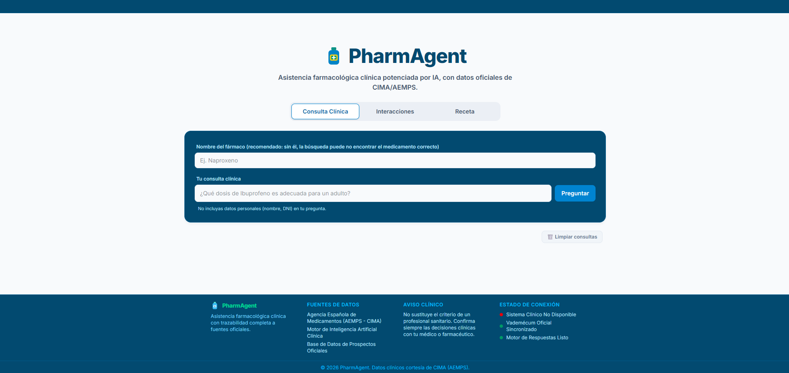
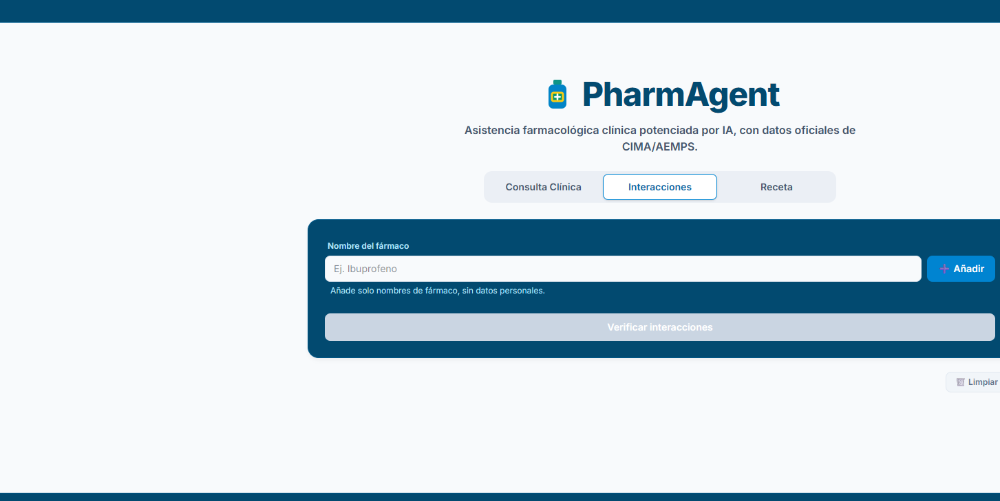
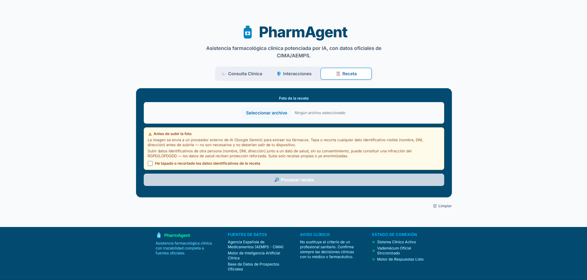

# PharmAgent

Trabajo de Fin de Máster (TFM) — sistema multiagente para el procesamiento de recetas
médicas, la verificación de interacciones farmacológicas y la consulta en lenguaje natural
de fichas técnicas oficiales de medicamentos autorizados en España (AEMPS/CIMA).

**Demo en vivo**: [pharmagent-ai.vercel.app](https://pharmagent-ai.vercel.app/) — pestaña
Receta en modo demo (solo 3 ejemplos sintéticos, ver
[ADR 002](docs/adr/002-datos-personales-foto-receta.md)); Consulta Clínica e Interacciones
funcionan contra los servicios reales (CIMA en vivo, Groq).

## Índice

- [Entrega del TFM](#entrega-del-tfm)
- [Descripción y objetivos](#descripción-y-objetivos)
- [Stack tecnológico y arquitectura](#stack-tecnológico-y-arquitectura)
- [Requisitos previos](#requisitos-previos)
- [Instrucciones de despliegue en local](#instrucciones-de-despliegue-en-local)
- [Despliegue con Docker Compose](#despliegue-con-docker-compose)
- [Despliegue en producción](#despliegue-en-producción)
- [Frontend (SPA)](#frontend-spa)
- [Imágenes del proyecto](#imágenes-del-proyecto)
- [Endpoints de la API](#endpoints-de-la-api)
- [Seguridad en un despliegue público](#seguridad-en-un-despliegue-público)
- [Pruebas automatizadas y cobertura](#pruebas-automatizadas-y-cobertura)
- [Evaluación cuantitativa](#evaluación-cuantitativa)
- [Migraciones de base de datos](#migraciones-de-base-de-datos)
- [Estado del proyecto](#estado-del-proyecto)

## Entrega del TFM

Recursos exigidos por la entrega del TFM (BIG School, Máster de Desarrollo con IA),
recopilados aquí para que sean fáciles de encontrar por quien evalúe el proyecto.

| Recurso | Ubicación |
|---|---|
| Documentación técnica completa | Este `README.md`, más [AGENTS.md](AGENTS.md), [SKILLS.md](SKILLS.md), [EVALUATION.md](EVALUATION.md) y [docs/adr/](docs/adr/) |
| Demo en producción (enlace directo) | [pharmagent-ai.vercel.app](https://pharmagent-ai.vercel.app/) — ver [Despliegue en producción](#despliegue-en-producción) para la arquitectura de despliegue completa (frontend/backend/base de datos) |
| Credenciales de prueba | **No aplica** — la demo pública no tiene login: es una SPA de acceso libre sin autenticación de usuarios (ver [Frontend (SPA)](#frontend-spa)). La única autenticación del proyecto es una `API_KEY` opcional a nivel de servicio para proteger la API de abuso anónimo, no un sistema de cuentas de usuario — ver [Seguridad en un despliegue público](#seguridad-en-un-despliegue-público) |
| Slides de la presentación | [Google Drive](https://drive.google.com/file/d/1RICqu9V7xi49T4y4H-8YsFKTUVUaG65T/view?usp=sharing).

## Descripción y objetivos

PharmAgent explora hasta qué punto un sistema multiagente, construido con
disciplina de Clean Architecture, puede apoyar tres tareas farmacéuticas concretas sin
comprometer la seguridad del paciente ni la privacidad de los datos de salud que maneja:

1. **Extracción estructurada de recetas** a partir de una imagen (foto o escaneo), usando
   comprensión multimodal (`PrescriptionAgent`, Gemini).
2. **Verificación de interacciones farmacológicas** entre los fármacos de una receta
   (`SafetyCheckAgent`): una base curada de interacciones documentadas actúa como fuente
   autoritativa, y para combinaciones no cubiertas por esa base se consulta opcionalmente a
   un modelo de lenguaje en la nube (Groq/`llama-3.1-8b-instant`) — con un veredicto
   explícito y nunca una aprobación silenciosa ante una interacción grave o ante
   incertidumbre del modelo.
3. **Consulta en lenguaje natural** sobre fichas técnicas oficiales de medicamentos
   (`RAGPharmAgent`), con respuestas *grounded* — basadas únicamente en la información
   recuperada, nunca en conocimiento no verificado del modelo.

Un cuarto flujo, `ProcessPrescriptionUseCase`, orquesta los dos primeros de extremo a
extremo: sube una imagen de receta → extrae los fármacos → si hay 2 o más, verifica
automáticamente sus interacciones — y persiste el resultado como registro auditable.

Un principio de diseño transversal, motivado por tratarse de datos de salud (categoría
especial según RGPD/LOPDGDD): **los embeddings se ejecutan siempre en local vía Ollama**, sin
excepción. La generación de texto (razonamiento de `SafetyCheckAgent` y respuestas de
`RAGPharmAgent`) se ejecuta en la nube vía Groq desde una migración posterior por latencia
(~30s en CPU local frente a <2s en Groq) — una decisión consciente de intercambiar la
privacidad estricta de "nunca sale de la máquina" por velocidad de respuesta percibida; solo
salen nombres de fármacos y fragmentos de ficha técnica, nunca datos identificativos del
paciente.

La otra llamada a un proveedor externo (Google Gemini) es la comprensión multimodal de
imágenes de recetas, que tampoco tiene alternativa local viable con calidad suficiente —
aquí el riesgo de privacidad es mayor y se documenta sin suavizarlo (decisión completa en
[ADR 002](docs/adr/002-datos-personales-foto-receta.md)): Gemini recibe la
**imagen completa** de la receta, y una receta real puede llevar visibles nombre del
paciente, DNI/NIE o dirección. Ni un aviso ni una casilla de confirmación cambian quién es
el responsable del tratamiento de esos datos ante el RGPD/LOPDGDD — sigue siendo quien opera
el servicio, no quien sube la foto. Por eso la mitigación real, no solo declarativa, es
distinta según el entorno:

- **Despliegue público (`VITE_DEMO_MODE=true` + `DEMO_MODE=true`)**: la pestaña de Receta
  **no acepta fotos de desconocidos en absoluto**. Solo permite arrastrar (o tocar) una de 3
  recetas de ejemplo 100% sintéticas ya presentes en la página (`frontend/public/samples/`,
  con pacientes explícitamente ficticios para que sea evidente que no hay datos reales de
  nadie) a una zona de destino con el mismo aspecto que la subida real — nunca hay un
  selector de archivos del sistema de por medio. Elimina el riesgo en vez de intentar
  gestionarlo. La restricción no depende solo del frontend: con
  `DEMO_MODE=true` el backend (`src/infrastructure/api/demo_mode.py`) rechaza con 403
  cualquier imagen subida a `/analyze-prescription`/`/process-prescription` cuyo hash SHA-256
  no coincida con uno de los 3 ejemplos, aunque se llame a la API directamente sin pasar por
  la interfaz.
- **Desarrollo local** (`VITE_DEMO_MODE` sin definir): mantiene la subida real, con
  mitigaciones en profundidad — ninguna suficiente por sí sola, pero sí honestas: el
  resultado extraído es lo único que se persiste (**la imagen nunca se guarda**, ni en la
  base de datos ni en logs); el *system prompt* de `GeminiClient` instruye explícitamente a
  no incluir ningún dato identificativo en la respuesta; el frontend exige una casilla de
  confirmación antes de habilitar el envío, con un aviso explícito de que subir datos
  identificativos de otra persona junto a un dato de salud sin su consentimiento puede
  constituir una infracción del RGPD/LOPDGDD (`frontend/index.html`, sección
  `prescription-upload-section`). Lo que ninguna de ellas evita: **Google procesa
  la imagen completa en sus servidores** antes de que cualquier filtro nuestro pueda actuar
  — sujeto a los términos de tratamiento de datos de Google, no a los nuestros. Un uso real
  con pacientes reales necesitaría además un acuerdo de encargado de tratamiento con Google.

## Stack tecnológico y arquitectura

| Capa | Tecnología |
|---|---|
| API web | FastAPI (async), Uvicorn |
| Validación / esquemas | Pydantic v2 |
| Persistencia | PostgreSQL 16 + `pgvector`, SQLAlchemy 2.0 async, `asyncpg`, Alembic (migraciones) |
| Embeddings locales | Ollama (`nomic-embed-text`) |
| LLM de generación remoto | Groq (`llama-3.1-8b-instant`), para `SafetyCheckAgent`/`RAGPharmAgent` |
| LLM multimodal remoto | Google Gemini (`google-genai`, modelo `gemini-flash-latest`), exclusivo para extracción de recetas |
| Fuente de datos oficial | API REST de CIMA/AEMPS (`https://cima.aemps.es/cima/rest`) |
| Observabilidad | Sentry (`sentry-sdk`, captura de errores a nivel de aplicación) |
| Seguridad (opcional) | API key ligera (`X-API-Key`) + rate limiting por IP (`slowapi`), ver [Seguridad en un despliegue público](#seguridad-en-un-despliegue-público) |
| Configuración | `pydantic-settings` (fuente única de variables de entorno) |
| Contenedores | Docker, Docker Compose |
| Calidad (backend) | Ruff (lint + format), Pytest + `pytest-cov` (umbral 85%) |
| Calidad (frontend) | TypeScript estricto (`tsc -b`), Vitest + `jsdom` |
| CI | GitHub Actions — 3 jobs independientes: `quality` (backend), `frontend` (tests + build), `migrations` (Alembic contra Postgres real) |
| Frontend | SPA estática en TypeScript + Tailwind CSS v4, Vite (`frontend/`) — cliente puro de la API REST, ver [Frontend (SPA)](#frontend-spa) |

### Arquitectura: Clean Architecture / monolito modular

Se adopta un monolito modular en capas concéntricas — ver
[ADR 001](docs/adr/001-stack-python-adk.md) para la justificación completa — con una regla
de dependencia estricta: **`src/domain/` no importa nada fuera de la librería estándar de
Python y Pydantic**. Las capas externas dependen del dominio a través de interfaces
(`typing.Protocol`), nunca al revés.

```
src/
├── domain/                      # Núcleo: reglas de negocio puras, sin dependencias externas
│   ├── models/                  # Entidades: Prescription, PrescribedDrug, DrugInteraction
│   └── ports/                   # Interfaces (Protocol) que la infraestructura satisface
├── application/                 # Casos de uso y agentes, dependen solo de domain/ports/
│   ├── agents/                  # RAGPharmAgent, PrescriptionAgent, SafetyCheckAgent
│   └── services/                # DrugService (orquestación CIMA + Ollama + pgvector)
├── use_cases/                   # Puntos de entrada explícitos e independientes del transporte
│                                #   ConsultDrugRAGUseCase, ProcessPrescriptionUseCase
└── infrastructure/              # Framework web, clientes externos, persistencia, configuración
    ├── api/                     # FastAPI: routers, esquemas Pydantic REST, main.py
    ├── config/                  # pydantic-settings (única fuente de variables de entorno)
    ├── external/                # CimaAPIClient, OllamaClient, GroqClient, GeminiClient
    ├── models/ · repositories/  # ORM SQLAlchemy + pgvector, repositorios
    └── database.py              # Motor async de PostgreSQL

migrations/                  # Migraciones Alembic (esquema versionado, no create_all)
evaluation/                  # Dataset sintético + script de evaluación cuantitativa
```

La inversión de dependencias se aplica mediante tipado estructural: `DrugService` y los
agentes de `application/` dependen de puertos (`CimaDataSourcePort`, `LanguageModelPort`,
`DrugRepositoryPort`, `PrescriptionVisionPort`, `PrescriptionRecordRepositoryPort` en
[drug_ports.py](src/domain/ports/drug_ports.py)), no de las clases concretas de
`infrastructure/`. Estas últimas los satisfacen por estructura (`Protocol`
`@runtime_checkable`), sin herencia — verificable con `isinstance()`. Esto permite sustituir
cualquier proveedor externo (o testear con dobles en memoria, ver
[Pruebas automatizadas](#pruebas-automatizadas-y-cobertura)) sin tocar el dominio ni los
agentes.

> Los agentes se documentan en detalle en [AGENTS.md](AGENTS.md) y las herramientas
> (*tools*) que definen su contrato conceptual en [SKILLS.md](SKILLS.md). Ambos documentos
> distinguen explícitamente el diseño objetivo original (orquestación vía Google ADK) del
> estado real implementado (invocación directa de métodos Python asíncronos).

## Requisitos previos

- **Python 3.11+** (CI y Docker fijados en 3.12 — ver [Dockerfile](Dockerfile)/
  [.github/workflows/ci.yml](.github/workflows/ci.yml); verificado también en local con 3.14).
- **Node.js 20+** (solo para el frontend, ver [Frontend (SPA)](#frontend-spa)).
- **Docker** y **Docker Compose** (para PostgreSQL + pgvector, Ollama y, opcionalmente, la
  propia API).
- Una **API key de Google Gemini** (opcional — solo necesaria para probar
  `/analyze-prescription`/`/process-prescription`; el resto de la API funciona sin ella). Se
  obtiene en [Google AI Studio](https://aistudio.google.com/).

## Instrucciones de despliegue en local

Estos pasos ejecutan la API directamente con Uvicorn (fuera de Docker), útil para
desarrollo activo. Para un despliegue completo en contenedores, ver
[Despliegue con Docker Compose](#despliegue-con-docker-compose).

1. **Clonar el repositorio e instalar dependencias** en un entorno virtual:

   ```bash
   python -m venv .venv
   .venv\Scripts\activate          # Windows
   # source .venv/bin/activate     # Linux/macOS
   pip install -r requirements.txt
   ```

   `requirements.txt` es un lockfile generado con [uv](https://docs.astral.sh/uv/) a partir
   de `requirements.in` (rangos + comentarios de contexto, la fuente de verdad editable) —
   fija exactamente las mismas versiones, transitivas incluidas, que las que pasan la suite
   de tests en CI, en vez de rangos sueltos que cada `pip install` podría resolver de forma
   distinta. Para regenerarlo tras cambiar `requirements.in`, ver el comentario al inicio de
   ese archivo.

2. **Levantar PostgreSQL (pgvector) y Ollama** con Docker Compose:

   ```bash
   docker compose up -d postgres ollama
   ```

3. **Descargar el modelo de embeddings de Ollama** (una sola vez; persiste en el volumen
   `ollama_data`). Ya no hace falta `llama3`: la generación de texto de `SafetyCheckAgent`/
   `RAGPharmAgent` se sirve desde Groq en la nube, no desde Ollama (ver paso 4):

   ```bash
   docker exec pharmagent_ollama ollama pull nomic-embed-text
   ```

4. **Configurar las variables de entorno**: copiar `.env.example` a `.env` y ajustar lo
   necesario (por defecto ya apunta al PostgreSQL/Ollama de `docker-compose.yml`):

   ```bash
   cp .env.example .env
   ```

   Añadir `GOOGLE_API_KEY` en `.env` solo si se va a probar `/analyze-prescription` o
   `/process-prescription`. Añadir `GROQ_API_KEY` (gratuita en [console.groq.com](https://console.groq.com/))
   para que `SafetyCheckAgent` razone sobre combinaciones no cubiertas por la base curada y
   `RAGPharmAgent`/`/consult` generen respuesta — sin ella, ambos degradan a una salida vacía
   en vez de fallar (ver `GroqClient`). `EMBEDDING_PROVIDER` debe permanecer en `ollama` — los
   embeddings de datos de salud nunca usan un proveedor externo, ver
   [Descripción y objetivos](#descripción-y-objetivos). Ver
   [Seguridad en un despliegue público](#seguridad-en-un-despliegue-público) para
   `API_KEY`/`RATE_LIMIT`/`CORS_ALLOWED_ORIGINS`/`DATABASE_SSL`.

5. **Aplicar las migraciones de base de datos** (crea el esquema, habilita `pgvector`):

   ```bash
   alembic upgrade head
   ```

6. **(Opcional) Poblar la caché semántica** con una ingesta inicial desde CIMA en vivo:

   ```bash
   python -m scripts.ingest_drugs
   ```

7. **Arrancar la API**:

   ```bash
   uvicorn src.infrastructure.api.main:app --reload --port 8000
   ```

   La documentación interactiva (OpenAPI/Swagger) queda disponible en
   `http://localhost:8000/docs`.

## Despliegue con Docker Compose

La API tiene su propio [Dockerfile](Dockerfile) (imagen `python:3.12-slim`, usuario no
root) y un servicio `api` en [docker-compose.yml](docker-compose.yml) que levanta los tres
componentes juntos:

```bash
cp .env.example .env   # ajustar GOOGLE_API_KEY si se necesita
docker compose up -d
```

El contenedor `api` ejecuta `alembic upgrade head` automáticamente antes de arrancar
Uvicorn (ver `command` en `docker-compose.yml`), así que el esquema de base de datos queda
listo sin pasos manuales. `DATABASE_URL`/`OLLAMA_BASE_URL` se sobrescriben dentro de
Compose para resolver los servicios por nombre de contenedor (`postgres`, `ollama`) en vez
de `localhost`. Tras el arranque, poblar la caché semántica igual que en el paso 6 anterior
(desde dentro del contenedor o desde el host, según convenga):

```bash
docker exec pharmagent_api python -m scripts.ingest_drugs
```

`docker-compose.yml` es en sí mismo el perfil endurecido: `api` corre con `read_only: true`
+ `cap_drop: [ALL]` (imagen propia, sin necesidad de escritura en disco ni de ninguna
capability Linux — ya corre como usuario sin privilegios), y ni `postgres` ni `ollama`
publican su puerto al host (`api` los resuelve por nombre en la red interna de Compose; no
lo necesita). `docker-compose.override.yml`, cargado automáticamente por `docker compose up`
en local, vuelve a publicar esos puertos solo para desarrollo (conectar un cliente SQL, o
correr la API fuera de Docker contra el mismo Postgres/Ollama). Para el perfil endurecido
explícitamente, sin el override:

```bash
docker compose -f docker-compose.yml up -d
```

## Despliegue en producción

La demo en vivo enlazada al principio de este documento usa tres servicios independientes,
pero el visitante solo ve uno (la URL de Vercel) — el backend y la base de datos nunca se
exponen directamente:

| Componente | Servicio | Notas |
|---|---|---|
| Frontend | [Vercel](https://vercel.com) | Estático (`frontend/`), sin build propio en el servidor — despliegue continuo desde `main`. |
| Backend | [Google Cloud Run](https://cloud.google.com/run) | Reutiliza el [Dockerfile](Dockerfile) tal cual, sin configuración específica de la plataforma. Despliegue continuo desde `main` vía Cloud Build. Capa gratuita ("Always Free") permanente, más que suficiente para el tráfico de una demo. |
| Base de datos | [Supabase](https://supabase.com) (Postgres + `pgvector`) | Elegido en vez del Postgres gratuito de Render/otros proveedores porque **no caduca** — necesario para que la demo siga viva después de la defensa del TFM. |

El contenedor del backend es el mismo en local, en Docker Compose y en producción — el
`CMD` del [Dockerfile](Dockerfile) aplica las migraciones y arranca Uvicorn en el puerto que
la plataforma indique vía la variable `PORT` (Cloud Run/Render la inyectan; en local, sin
definir, usa el 8000 de siempre), así que no hace falta ninguna configuración específica de
plataforma más allá de las variables de entorno de siempre (ver
[Seguridad en un despliegue público](#seguridad-en-un-despliegue-público)).

Variables de entorno propias de este despliegue, además de las ya documentadas: `DEMO_MODE=true`
+ `VITE_DEMO_MODE=true` (modo demo activo en ambos lados, ver
[ADR 002](docs/adr/002-datos-personales-foto-receta.md)) y `CORS_ALLOWED_ORIGINS` restringido
al dominio real de Vercel (no `["*"]`).

## Frontend (SPA)

[frontend/](frontend/) es una SPA estática (TypeScript + Tailwind CSS v4, compilada con Vite,
sin framework de UI — DOM directo) que consume la API REST vía `fetch`: un cliente externo
más, no importa nada del backend Python — solo conoce `VITE_API_BASE_URL`
(`http://localhost:8000` por defecto) y los contratos JSON de
[drug_schemas.py](src/infrastructure/api/schemas/drug_schemas.py) (espejados a mano en
[frontend/src/types.ts](frontend/src/types.ts)).

```bash
cd frontend
npm install
cp .env.example .env.local   # opcional, solo si la API no está en localhost:8000
npm run dev                  # servidor de desarrollo en http://localhost:5173
npm test                     # suite Vitest
```

`npm run build` genera la versión de producción en `frontend/dist/` (sin paso de servidor:
son ficheros estáticos que puede servir cualquier CDN/hosting estático, apuntando
`VITE_API_BASE_URL` a la API desplegada).

Diseño de una sola columna centrada (sin barra lateral ni login), tres pestañas sobre la
misma barra de navegación:

1. **Consulta Clínica** (`POST /consult`) — pregunta en lenguaje natural con autocompletado
   de nombre de fármaco (`POST /search` con debounce, mientras escribes), síntesis en
   Markdown, badge de latencia medida en cliente y chip de procedencia (`cache`/`live`/
   `none`), fuentes CIMA en un desplegable.
2. **Interacciones** (`POST /check-interactions`) — lista dinámica de fármacos (con el mismo
   autocompletado), veredicto y tarjetas de riesgo coloreadas por severidad.
3. **Receta** (`POST /process-prescription`) — subida de imagen con vista previa,
   extracción + auditoría de seguridad automática, y ficha CIMA por fármaco extraído
   (`POST /search`).

Las tres vistas tienen un botón "Limpiar" para descartar los resultados acumulados. El
footer (en vez de una barra lateral) agrupa la marca, las fuentes de datos, el aviso clínico
y el estado de conexión — este último se autocomprueba contra `/health` al cargar la página;
la pila de persistencia y el motor LLM se muestran como información declarada, no verificada
en vivo (no existe un endpoint de estado para ellos).

**Tests**: Vitest + `jsdom` (`frontend/src/*.test.ts`) cubren la lógica sin DOM completo —
mapeos de severidad/veredicto/procedencia a HTML, escapado seguro de texto interpolado, el
debounce del autocompletado y la sanitización de la síntesis Markdown (XSS). Se ejecutan en
su propio job de CI, independiente del backend.

## Imágenes del proyecto

| Consulta Clínica | Interacciones | Receta |
|---|---|---|
|  |  |  |

## Endpoints de la API

Prefijo común: `/api/v1/pharmacy` (excepto `/health`). Sin `API_KEY` configurada (por
defecto, desarrollo local) la API se sirve abierta, sin autenticación; con `API_KEY`
configurada (recomendado para cualquier despliegue público) exige la cabecera `X-API-Key`
en todo el prefijo — ver [Seguridad en un despliegue público](#seguridad-en-un-despliegue-público).

| Método | Ruta | Descripción | Agente / servicio |
|---|---|---|---|
| `GET` | `/health` | Comprobación de disponibilidad del servicio | — |
| `GET` | `/internal/metrics` | Latencia p50/p95 por proveedor LLM y tasa de fallback a CIMA en vivo (diagnóstico, no de negocio) | `metrics.py` |
| `POST` | `/search` | Búsqueda de fármacos: caché vectorial primero, CIMA en vivo como respaldo automático | `DrugService` |
| `POST` | `/consult` | Consulta en lenguaje natural, respuesta *grounded* (caché + CIMA en vivo como respaldo) | `RAGPharmAgent` |
| `POST` | `/check-interactions` | Verificación de interacciones entre 2+ fármacos (base curada + LLM en la nube vía Groq) | `SafetyCheckAgent` |
| `POST` | `/analyze-prescription` | Extracción estructurada desde imagen de receta | `PrescriptionAgent` |
| `POST` | `/process-prescription` | Flujo completo: extracción + verificación automática de interacciones, con persistencia auditable | `ProcessPrescriptionUseCase` |

`/internal/metrics` sí exige `X-API-Key` cuando `API_KEY` está configurada (a diferencia de
`/health`, que debe quedar abierta para los chequeos de salud del proveedor de despliegue) —
ver [Resiliencia y observabilidad](#resiliencia-y-observabilidad-de-los-clientes-externos).

### Ejemplos de uso

**Búsqueda de fármacos** (`POST /api/v1/pharmacy/search`) — consulta primero la caché
vectorial local; si no encuentra nada suficientemente relevante, busca en vivo en CIMA
(AEMPS) automáticamente y lo indexa para que consultas futuras sobre el mismo fármaco sean
instantáneas:

```json
// Request
{ "query": "metformina", "limit": 3 }
```

```json
// Response 200 (fármaco no cacheado todavía → consultado en vivo en CIMA)
{
  "results": [
    {
      "nregistro": "68167",
      "nombre": "METFORMINA CINFA 850 mg COMPRIMIDOS RECUBIERTOS CON PELICULA EFG",
      "pactivos": "METFORMINA HIDROCLORURO",
      "labtitular": "Laboratorios Cinfa S.A."
    }
  ],
  "source": "live"
}
```

`source` indica la procedencia: `"cache"` (caché vectorial local), `"live"` (CIMA en vivo,
recién indexado) o `"none"` (ni la caché ni CIMA en vivo encontraron nada — puede ocurrir si
el nombre no coincide literalmente con cómo lo registra CIMA, p. ej. "warfarina" no se
encuentra porque en España se comercializa como "Aldocumar").

**Consulta RAG** (`POST /api/v1/pharmacy/consult`) — mismo mecanismo caché+CIMA en vivo que
`/search`; el campo opcional `drug_name` acota la búsqueda del fármaco cuando `query` es una
pregunta en lenguaje natural sin el nombre exacto (CIMA hace coincidencia literal de nombre,
no búsqueda semántica):

```json
// Request
{ "query": "¿qué dosis es adecuada para un adulto?", "drug_name": "ibuprofeno" }
```

```json
// Response 200
{
  "query": "¿qué dosis es adecuada para un adulto?",
  "response": "La dosis habitual en adultos es de 400-600 mg cada 8 horas...",
  "sources": [
    {
      "nombre": "Ibuprofeno Test 600mg",
      "ficha_tecnica_url": "https://cima.aemps.es/cima/dochtml/ft/12345/FT_12345.html",
      "prospecto_url": "https://cima.aemps.es/cima/dochtml/p/12345/P_12345.html"
    }
  ],
  "source": "cache"
}
```

**Verificación de interacciones** (`POST /api/v1/pharmacy/check-interactions`):

```json
// Request
{ "drugs": ["Warfarina 5mg", "Aspirina 100mg"] }
```

```json
// Response 200
{
  "interactions": [
    {
      "primary_drug": "warfarina",
      "secondary_drug": "aspirina",
      "severity": "SEVERE",
      "description": "Efecto anticoagulante/antiagregante combinado: aumenta significativamente el riesgo de hemorragia.",
      "clinical_recommendation": "Evitar la combinación salvo indicación médica expresa; si es necesaria, monitorizar INR estrechamente.",
      "source": "curated"
    }
  ],
  "verdict": "requiere_revision_medica"
}
```

`source` indica si la interacción procede de la base curada interna (`"curated"`,
autoritativa) o del razonamiento del modelo local para una combinación no cubierta por esa
base (`"llm"`) — ver [AGENTS.md](AGENTS.md#2-safetycheckagent) para el diseño híbrido
completo y [EVALUATION.md](EVALUATION.md) para su exactitud medida.

**Análisis de receta** (`POST /api/v1/pharmacy/analyze-prescription`, `multipart/form-data`
con campo `file`):

```json
// Response 200
{
  "drugs": [
    { "farmaco": "Ibuprofeno", "dosificacion": "600 mg", "frecuencia": "cada 8 horas", "duracion": "5 días" }
  ],
  "advertencias": ["Tomar con alimentos."]
}
```

**Flujo completo** (`POST /api/v1/pharmacy/process-prescription`, `multipart/form-data` con
campo `file`):

```json
// Response 200
{
  "prescription": {
    "drugs": [
      { "farmaco": "Warfarina", "dosificacion": "5 mg", "frecuencia": "cada 24 horas", "duracion": "30 días" },
      { "farmaco": "Aspirina", "dosificacion": "100 mg", "frecuencia": "cada 24 horas", "duracion": "30 días" }
    ],
    "advertencias": []
  },
  "safety_check": {
    "interactions": [
      { "primary_drug": "warfarina", "secondary_drug": "aspirina", "severity": "SEVERE", "...": "..." }
    ],
    "verdict": "requiere_revision_medica"
  }
}
```

`safety_check` es `null` si la extracción identificó menos de 2 fármacos. El resultado
completo se persiste como registro auditable en la tabla `prescription_records` (ver
[Migraciones de base de datos](#migraciones-de-base-de-datos)).

## Seguridad en un despliegue público

En desarrollo local, la API se sirve completamente abierta — sin autenticación, sin límite
de peticiones — para consumo del frontend local sin ninguna fricción:

```bash
curl http://localhost:8000/api/v1/pharmacy/search -d '...'
```

Antes de exponerla a Internet, varias variables de entorno pasan a ser relevantes (todas en
[.env.example](.env.example)):

- **`API_KEY`**: vacía por defecto (auth desactivada). Con un valor, `pharmacy_router` exige
  la cabecera `X-API-Key` en cada petición (ver `security.py`). El frontend desplegado la
  envía automáticamente si se le da el mismo valor en su propio `VITE_API_KEY`
  ([frontend/.env.example](frontend/.env.example)) — un visitante normal de la web no ve ni
  introduce ninguna clave, solo bloquea a quien ataque la API directamente sin pasar por el
  frontend. Como la clave vive en el bundle del navegador, no es un secreto fuerte — de ahí
  el punto siguiente.
- **`RATE_LIMIT`** (`5/minute` por defecto — deliberadamente bajo, proyecto demo/portfolio,
  no un servicio con tráfico real esperado): límite de peticiones por IP en todo
  `pharmacy_router`, vía `slowapi`. Acota el coste máximo posible en Groq/Gemini aunque la
  API key se filtre. `/health` queda exenta explícitamente para no interferir con los
  chequeos de salud del proveedor de despliegue.
- **`CORS_ALLOWED_ORIGINS`** (`["*"]` por defecto, lista JSON): restringir al dominio real
  del frontend desplegado, p. ej. `CORS_ALLOWED_ORIGINS=["https://pharmagent.vercel.app"]`.
- **`DATABASE_SSL`** (`false` por defecto): el Postgres de `docker-compose.yml` no ofrece
  SSL; un Postgres gestionado en un proveedor de despliegue normalmente sí lo exige —
  `DATABASE_SSL=true` ahí, o la conexión falla (ver `database.py`).
- **`DEMO_MODE`** (`false` por defecto): en conjunto con `VITE_DEMO_MODE=true` del frontend
  (ver sección anterior), hace que el backend rechace con 403 cualquier imagen subida a
  `/analyze-prescription`/`/process-prescription` que no sea uno de los 3 ejemplos
  sintéticos permitidos (`src/infrastructure/api/demo_mode.py`, comprobación por hash
  SHA-256) — cierra la brecha de que la restricción de la interfaz, por sí sola, no impide
  llamar a la API directamente con una foto real.

Además, todo el cuerpo de las peticiones está limitado a 10 MB (`MaxBodySizeMiddleware` en
`main.py`) — protege de subidas descontroladas en los endpoints de receta.

Ninguna de estas medidas sustituye una autenticación de usuarios real ni resuelve por sí
sola el tratamiento de datos personales en la foto de receta — ver
[ADR 002](docs/adr/002-datos-personales-foto-receta.md) para esa decisión, independiente de
esta.

### Resiliencia y observabilidad de los clientes externos

Los 4 clientes de infraestructura que hacen llamadas de red (`CimaAPIClient`, `GroqClient`,
`OllamaClient`, `GeminiClient`) comparten dos mecanismos, además del contrato defensivo que
ya tenían (nunca propagan una excepción; degradan a un valor vacío):

- **Reintentos con backoff exponencial** (`tenacity`, ver
  [retry.py](src/infrastructure/external/retry.py)): hasta 3 intentos, solo ante un fallo
  transitorio (error de red/timeout, `429`, `5xx`) — nunca ante un `4xx` de validación, que
  no se arregla reintentando la misma petición.
- **Logging estructurado en JSON** (ver
  [logging_config.py](src/infrastructure/logging_config.py)): cada fallo se registra con
  contexto (parámetros de la llamada, error) justo antes de degradar, no en su lugar — así
  un fallo repetido de un proveedor es visible en los logs del proveedor de despliegue, en
  vez de desaparecer silenciosamente detrás de la respuesta vacía.
- **Métricas básicas en memoria** (ver [metrics.py](src/infrastructure/metrics.py),
  expuestas en `GET /internal/metrics`): latencia p50/p95 por proveedor (`groq`, `gemini`,
  `ollama_completion`, `ollama_embedding`) y tasa de fallback a CIMA en vivo
  (`DrugService.search_drugs_semantic`). Sin Prometheus ni backend externo — un snapshot que
  se reinicia con el proceso, suficiente para responder "¿qué proveedor está lento/fallando
  ahora mismo?" sin tener que grepear logs, no para sustituir observabilidad real en un
  servicio con tráfico de producción.

## Pruebas automatizadas y cobertura

```bash
# Backend
pytest                                      # suite completa (unit + integration)
pytest --cov=src --cov-report=term-missing  # con reporte de cobertura
ruff check .                                # lint
ruff format --check .                       # formato

# Frontend
cd frontend && npm test                     # suite Vitest
```

La suite de backend (`tests/unit/`, `tests/integration/`) es determinista y no requiere
Docker, red ni credenciales: las dependencias externas (CIMA, Ollama, Groq, PostgreSQL,
Gemini) se sustituyen por dobles en memoria vía `app.dependency_overrides` de FastAPI (ver
[tests/integration/conftest.py](tests/integration/conftest.py)) o vía `httpx.MockTransport`/
mocks directos para los clientes HTTP individuales (`tests/unit/test_cima_client.py`,
`test_ollama_client.py`, `test_groq_client.py`, `test_gemini_client.py`), aprovechando que la
propia arquitectura de puertos del dominio hace estos dobles triviales de construir.
Cobertura actual: **~89%** de la lógica de negocio del backend (umbral de CI: 85%).

El frontend tiene su propia suite (Vitest + `jsdom`, ver [Frontend (SPA)](#frontend-spa)),
separada de `pytest-cov` por ser TypeScript. El pipeline de integración continua
([.github/workflows/ci.yml](.github/workflows/ci.yml)) tiene tres jobs independientes en
cada `push`/`pull_request` a `main`: `quality` (lint, formato, tests + cobertura del
backend), `frontend` (tests + build de TypeScript) y `migrations` (aplica las migraciones
Alembic contra un Postgres real de servicio, ejecuta contra él los tests de repositorio
marcados `postgres` — excluidos del `pytest` por defecto, ver
[tests/integration/test_drug_repository_postgres.py](tests/integration/test_drug_repository_postgres.py) —
y por último verifica el roundtrip de downgrade/upgrade).

Un cuarto workflow, independiente de los anteriores
([.github/workflows/dependency-audit.yml](.github/workflows/dependency-audit.yml)), corre
`pip-audit`/`npm audit` cada lunes (además de a demanda, `workflow_dispatch`) — detecta CVEs
publicadas en dependencias ya fijadas después del último commit, sin depender de que alguien
se acuerde de comprobarlo a mano.

## Evaluación cuantitativa

Además de la suite de tests (que verifica comportamiento, no exactitud), el proyecto incluye
una evaluación cuantitativa de `SafetyCheckAgent` y `PrescriptionAgent` sobre un dataset
sintético, ejecutada contra los servicios reales (Ollama, Gemini):

```bash
python -m evaluation.run_evaluation
```

Resultados de referencia, metodología, limitaciones y hallazgos (incluyendo un bug real de
producción descubierto durante la evaluación) están documentados en
[EVALUATION.md](EVALUATION.md).

## Migraciones de base de datos

El esquema se gestiona con Alembic (no `Base.metadata.create_all`):

```bash
alembic upgrade head              # aplicar todas las migraciones pendientes
alembic revision --autogenerate -m "descripción"   # generar una nueva migración tras cambiar un modelo ORM
alembic downgrade -1              # revertir la última migración
```

`migrations/env.py` usa `settings.database_url` (misma fuente de configuración que el resto
de la aplicación) y `Base.metadata` de los modelos ORM reales — no hay una URL de conexión
duplicada en `alembic.ini`.

## Estado del proyecto

En resumen: los tres agentes, la orquestación end-to-end, la API REST completa (con CORS y
persistencia auditable), la ingesta desde CIMA (por lotes y automática al consultar), las
migraciones versionadas, la suite de tests con cobertura medida en ambos lados (backend y
frontend), el pipeline de CI de 3 jobs y el **despliegue en producción** (ver
[Despliegue en producción](#despliegue-en-producción)) están implementados y verificados
contra servicios reales — no solo contra dobles de test.

Ver [docs/audit_report.md](docs/audit_report.md) para la auditoría técnica completa
(arquitectura/DIP, seguridad/RGPD, resiliencia, observabilidad, CI/CD) con los 9 hallazgos
encontrados, priorizados P0/P1/P2, y su verificación de cierre contra código y tests reales.

Limitaciones conocidas y aceptadas (fuera de alcance hasta ahora): la base curada de
`SafetyCheckAgent` (20 pares) sigue siendo de demostración, no una fuente clínica completa —
su complemento por LLM para combinaciones no cubiertas es un mecanismo de asistencia, no un
dato verificado; el respaldo de CIMA en vivo de `/search` y `/consult` depende de que el
nombre buscado coincida literalmente con cómo lo registra CIMA (sin búsqueda semántica del
lado de CIMA); la autenticación por API key es opcional y ligera (protege de abuso anónimo,
no es un sistema de usuarios — ver
[Seguridad en un despliegue público](#seguridad-en-un-despliegue-público)); no existe
todavía una entidad de dominio `Drug` desacoplada del modelo ORM; y la extracción de
`PrescriptionAgent` se persiste como registro auditable en JSON crudo, no normalizada a la
entidad de dominio estricta `Prescription`/`PrescribedDrug` (ver la nota de diseño en
[prescription_record_model.py](src/infrastructure/models/prescription_record_model.py)).

**Mejora futura identificada, no implementada**: el razonamiento del LLM en
`SafetyCheckAgent` para combinaciones no cubiertas por la base curada (`source: "llm"`) es
conocimiento paramétrico del modelo, no *grounded* en ningún documento — a diferencia de
`RAGPharmAgent`, que sí recupera texto real de CIMA antes de responder. No es un descuido:
CIMA/AEMPS no publica ningún endpoint de interacciones farmacológicas, así que no hay un
documento equivalente que recuperar para ese dato concreto. Sin embargo, la ficha técnica
oficial de cada fármaco sí incluye una sección de interacciones (punto 4.5, "Interacción con
otras formas de interacción") — un trabajo futuro razonable sería pasarle esas secciones al
LLM como contexto (mismo patrón RAG que ya usa `RAGPharmAgent`) en vez de dejarlo razonar sin
ningún texto de referencia, acercando la fiabilidad del camino LLM a la del resto del
sistema.
